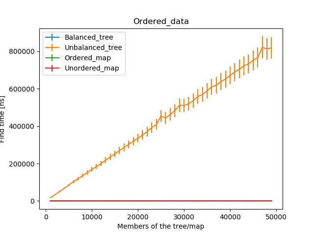
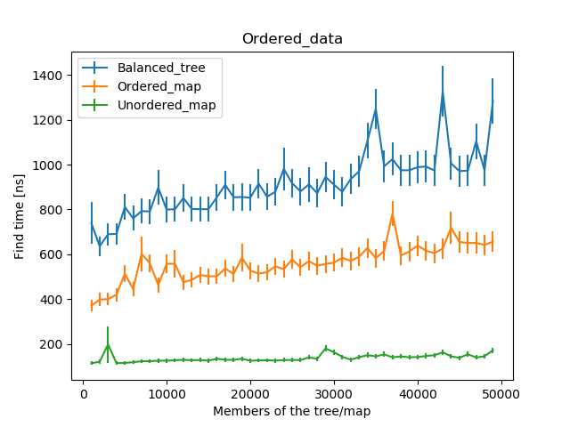
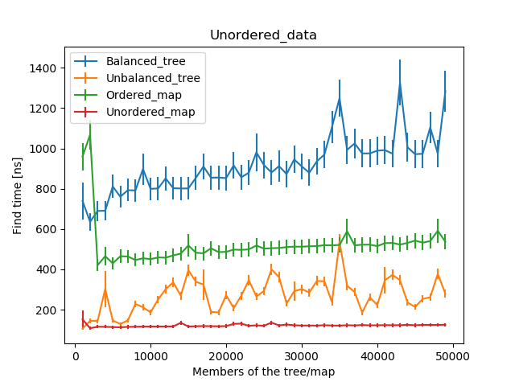

# Advanced Programming - Binary Search Tree

Binary Search Tree implementation for the Advanced Programming 2019-2020 course.

Authors:

- Iuri Macocco \<[imacocco@sissa.it](email:imacocco@sissa.it)\>
- Mattia Ubertini \<[mubertin@sissa.it](email:mubertin@sissa.it)\>

## Documentation

We built a standard Doxygen documentation in both html and pdf formats. Those can be found in the respective folders.

## How to Compile & Run

### How to use the `Makefile`

All the code can be foud in the folder BST. The `make` commands are all supposed to be run in it.

+ In order to compile the source files and run the test executable in which we have tested all the 
features and the function of the BST:
  
  ```bash
  make test
  ./test
  ```

+ In order to compile and run the benchmark we have developed within the file "main_benchmark.cc":

  ```bash
  make benchmark
  ./benchmark
  ```

+ To generate the documentation (Doxygen is needed) run
  
  ```bash
  make documentation
  cd latex
  make
  ```
  This will generate a pdf document named Refman.pdf in latex/ folder

+ To generate all the previous files in one shot just run
  
  ```bash
  make
  ```
  or 

  ```bash
  make all
  ```
+ To clean everything and recompile from scratch run

  ```bash
  make clean
  ```
  
The executables have been compiled using `g++ (Ubuntu 7.5.0-3ubuntu1~18.04) 7.5.0`. We ran everything with `valgrind` and no memory leaks were reported. 

## Code structure

The code is seperated in three different header files in the folder "include": 

+ `node.hpp`: it is implemented the struct `node`. It is templated on the value associated to a node (which in BST case will be std::pair<Key_type,Value_type>). The value can be accesed through `node.value`. It has two `std::unique_ptr` pointing to left and right children and a `node*` to the parent node. 
It is contained within the `AP_node` namespace. 
+ `iterator.hpp`: it is implemented the iterator class `iterator`. It is templated on the node_type and on the value_type contained within the node. The iterator has as private member a `node*` named current representing the pointer to the node pointed by the iterator object. The aim of the iterator is to move easily across the nodes of the BST.
It is contained within the `AP_it` namespace.

+ `bst.hpp`: it is implemented the binary search tree class. It is templated on the key type, value type associated to the nodes and the operation used to compare the nodes through its key values. In particular, the BST implemented is templated on `std::less<Key_type>` (< operator).   
Most of the functions are declared in this header file but they are implemented in the `src/bst.cc` file. 
It is contained within the `BST` namespace.


## Benchmarks
We implemented some performance tests in the `main_benchmark.cc` file. In particular, we have checked the average time spent to find 200 random keys by means of `find()` operation implemented in BST for a balance and unbalanced tree againt the `find()` function in `std::map` and in `std::unordered_map`.
We have run two tests on trees and maps in which we have inserted ordered and unordered keys.
The case with ordered keys:

As it can be clearly seen the performance obtained for the Unbalanced_tree are extremly poor. This was expected as by inserting ordered data happens to have a single branch if the tree is not balanced. As it can be seen from the plot the average to find a key in the unbalanced case grows linearly with the members of the tree. As soon as the tree is balanced and its depth reduced as we can see in the following picture the performance are comparable on the order of magnitude with the both maps. 

Although, the maps outperforms the `find()` function applied to the balanced_tree. In particular the `std::unordered_map` appears to be the fastest ones. 
In the case of randomized data insertions we have observed that the worst results are obtained by the balanced_tree while the unbalanced tree lies in between the two maps.



